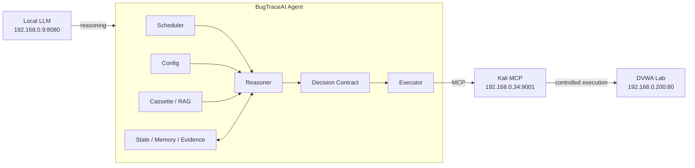

# BugTraceAI Agentic

> **v0.1.0-alpha — DVWA Research Release**

`bugtraceai-agentic` is a **working project name**. This repository publishes a reproducible Alpha snapshot of the BugTraceAI scientific research project: an experimental local-LLM agent architecture for autonomous cybersecurity analysis in a controlled laboratory.

**DVWA is the only target claimed as validated here.** Work on bWAPP and other environments belongs to the continuing generalization study and is not presented as a supported capability of this Alpha.

## Why this project exists

BugTraceAI investigates whether an LLM-driven agent can preserve a stable architecture while target, security level, knowledge context and experimental conditions change. The design separates reasoning from execution instead of embedding a vulnerability playbook directly into the agent.

## Release identity

| Item | Alpha value |
|---|---|
| Public release | `v0.1.0-alpha` |
| Scientific baseline | `v3.0.5b-r0-v2-repair` |
| Final Alpha patch | bounded contract-repair `action` type guard |
| Validated target | DVWA laboratory |
| MCP component | `kali_mcp-v2.5.6d-open` |
| License | Apache-2.0 |

Original baseline version markers are retained inside `agent/` for scientific traceability and should not be confused with the public release number.

## Architecture



- **Config** defines environment, access, restrictions, scope and experiment parameters.
- **Cassette/RAG** contributes contextual knowledge.
- **Reasoner** chooses the next action under a structured contract.
- **Executor/MCP** performs permitted execution.

A resource being observed does **not** automatically mean it is selected, analyzed or executed against.

## Reference laboratory

```text
Local LLM : 192.168.0.9:8080
DVWA      : 192.168.0.200:80
Kali MCP  : 192.168.0.34:9001
```

These values are deliberately visible because this Alpha prioritizes reproducibility over a polished installer.

## Reference local LLM

```bash
~/llama.cpp/build/bin/llama-server \
  -m ~/llm/models/offensive/BugTraceAI-CORE-Ultra-SFT-Q6_K.gguf \
  --host 0.0.0.0 --port 8080 --ctx-size 16384 \
  --threads 8 --threads-http 4 --n-gpu-layers 99 \
  --batch-size 512 --parallel 1 --flash-attn on --reasoning off
```

This is a reference experiment configuration, not a universal hardware/model requirement.

## Repository layout

```text
agent/   Scientific DVWA baseline and cassettes
mcp/     Audited Kali MCP v2.5.6d-open and benign lab assets
docs/    Research, architecture, setup and limitations
```

Generated logs, reports, runtime projects, caches, compiled Python files and the experimental bWAPP configuration are deliberately excluded.

## Contract safety

The Reasoner uses structured actions and validation before execution. The final bounded repair can fill missing required fields only; it cannot silently replace the chosen action or overwrite supplied fields, and repaired output must pass normal validation.

The DVWA policy preserves the authenticated cookie-jar model and constrains Upload testing to benign research artifacts.

## Getting started

1. Build an isolated DVWA laboratory.
2. Prepare the Kali MCP host and supplied MCP component.
3. Start the local LLM endpoint.
4. Review reference IPs and DVWA profile in `agent/config/` and `agent/config.env`.
5. Initialize the agent and run the experiment using the baseline scripts.

This release intentionally does not hide target-specific settings behind a new installer. See [configuration](docs/configuration.md) and [reference lab](docs/reference-lab.md).

## Limitations

- Alpha research software; interfaces and project name may change.
- DVWA is the supported/validated target of this release.
- Some client-side/browser-dependent cases require operator validation.
- Resolution depends on local model, context, budgets and experimental configuration.
- bWAPP, Juice Shop and WebGoat are roadmap targets, not capabilities claimed by this release.

## Responsible use

Use BugTraceAI only on systems you own or are explicitly authorized to test. The included defaults are for an intentionally vulnerable, isolated DVWA laboratory.

## Documentation

[Project overview](docs/project-overview.md) · [Methodology](docs/scientific-methodology.md) · [Architecture](docs/architecture.md) · [Reference lab](docs/reference-lab.md) · [Configuration](docs/configuration.md) · [Kali MCP](docs/kali-mcp.md) · [Roadmap](docs/limitations-and-roadmap.md) · [Security](SECURITY.md) · [Contributing](CONTRIBUTING.md)

## License

Licensed under the **Apache License 2.0**. See `LICENSE`.
