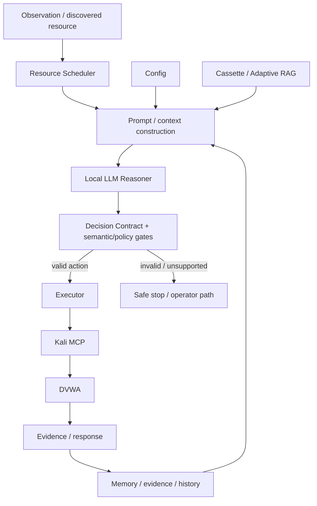

# Architecture and components

## Scheduler and discovery

`resource_scheduler.py`, `discovery_manager.py` and the analysis queue coordinate which resource is active and how the run progresses. This keeps navigation/discovery mechanics separate from the LLM decision itself.

## Reasoner

`reasoner_llm.py` calls the local llama-server and expects structured JSON actions. `decision_contract.py`, `semantic_claim_gate.py`, `policy_engine_v260.py` and related diagnostics constrain the transition from model output to executable behavior.

The final Alpha patch adds an explicit check that the repaired `action` is a non-empty string before it is used as a contract key. This is a defensive contract fix, not a new reasoning strategy.

## Config versus Cassette

**Config** is operational: target, authentication, HTTP behavior, budgets, discovery, validation profiles, blacklist/scope and Reasoner settings.

**Cassette/RAG** is epistemic context: generic security concepts, technology context and optional operator knowledge. Retrieved knowledge is not itself proof of a vulnerability.

## Executor and MCP

`executor_mcp.py` translates approved actions into the controlled Kali execution boundary. The separately published MCP contains tool wrappers, scope/destructive-operation controls, DVWA session handling and benign validation assets.
